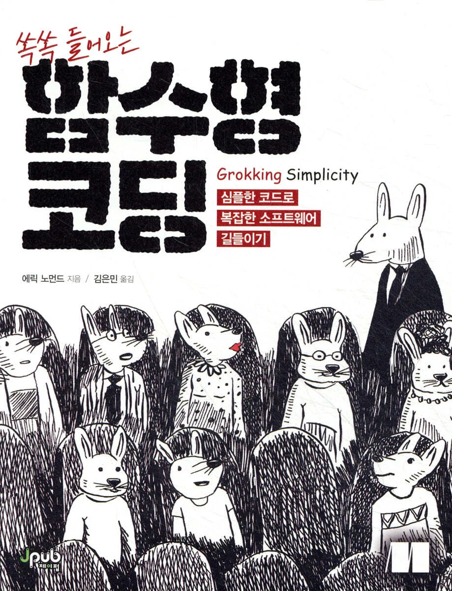

# 함수형 코딩 스터디 개요

### 스터디 주제

『함수형 코딩』 책 기반으로 **함수형 프로그래밍 개념과 실전 예제**를 학습하고 정리합니다.

### 목표

- 함수형 프로그래밍 핵심 개념 이해
- 실습 예제를 통해 코딩 습관 개선
- 개인 학습 기록을 체계적으로 정리하여 복습 자료로 활용

### 진행 기간

2025년 8월 ~ 2025년 10월 (약 3개월)

### 진행 방식

- **하루에 한 챕터씩** 『함수형 코딩』을 학습
- **주 3회 온라인**, 각 **2시간** 진행
- 학습 후 **공부한 내용을 정리하고 서로 발표 및 토론**
- 각자 **실습 코드에 개념 적용**
- 최종적으로 **블로그에 기록하여 공유**
